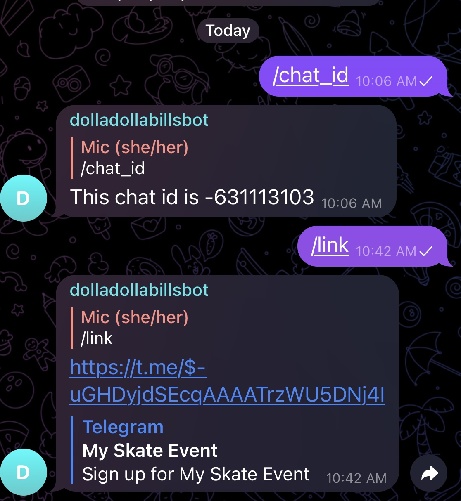

# payments_bot

This is based on what I read [here](https://medium.com/@tr_18329/build-a-telegram-bot-with-payments-and-a-database-from-a-z-8f54ee1e1ecf)
But it is using an out of date version so his code doesn't run.

## CURRENT STATUS:

Works locally with test Stripe credentials, is not deployed anywhere.
If it will be used IRL, add an `iac` directory and deploy in AWS ec2 instance.

To run locally after setup:

`source venv/bin/activate`

`python src/bot.py`

## NOTES

- [Gspread docs](https://docs.gspread.org/en/latest/index.html)
- [python-telegram-bot docs](https://docs.python-telegram-bot.org/en/stable/index.html)

## Set Up Your Own Event Payment Bot

From here, `words that looks like this` are commands you are meant to type somewhere, usually into a [terminal](https://itconnect.uw.edu/learn/workshops/online-tutorials/web-publishing/what-is-a-terminal/).

- Install python on your local machine

  - Google it or go [here](https://www.python.org/psf/).

- From the terminal navigate to the directory you want this code to live and. [Fork this repo](https://github.com/mdaizovi/payments_bot/fork) and then clone your fork by typing the following into a terminal:

  `git clone <URL-OF-YOUR-FORK>`

- `cd payments_bot` to get into repo. `cd` is how you change folders from the command line.

- Copy `payments_bot/.env.example` to `.env`.
  You can do this by typing `cp payments_bot/.env.example payments_bot/.env` in the terminal.
- Make a Virtual Environment:

  - If you have python 3.9 on your system, you can make a virtual environment like so:
    - `python -m venv venv`
    - If that doesn't work, you might need to type `python3 -m venv venv`

- Activate virtual environment:

  `source venv/bin/activate`

- Install backend requirements (make sure you are in your virtual environment first):

  `pip install -r requirements.txt`

  - If that doesn't work, you might need to type `pip3 install -r requirements.txt`

## To Use Payment Bot

### Set up Google Docs "Database":

- Follow [these instructions](https://towardsdatascience.com/turn-google-sheets-into-your-own-database-with-python-4aa0b4360ce7) to set up the Google Sheets API
- Put the `gs_credentials.json` in the `src/creds` directory of this directory, but DO NOT PUT IT ON GITHUB that file has secrets no one should see. `.gitignore` is already set up to ignore it.

- Copy [this google sheet](https://docs.google.com/spreadsheets/d/1F_5xXnd_YYUlAuT_UHWWSSmYiYxvSmJTaN2pSen9cO4/edit?usp=sharing)
- Change the name of the google sheet from `Telegram Bookings Backend EXAMPLE` to `Telegram Bookings Backend`
  - You can call it something else, but if you do you need to also change the value of `SPREADSHEET_NAME` in `src/settings.py`
- The only cells you should ever edit in the google sheet are the ones that are light green. The rest needs to stay as it is for the Bot to read/write from it properly.

### Set up Bot:

- Create Your Own Bot

  - While logged in to your account on Telegram, [make a bot](https://medium.com/shibinco/create-a-telegram-bot-using-botfather-and-get-the-api-token-900ba00e0f39)

  - BotFather will give you an API Key. Put that in your `.env` file under `TELEGRAM_BOT_TOKEN`

  - Set up your Stripe Account and put your token in `STRIPE_TOKEN` in `.env`

  - Set yourself as Admin by changing the value of `ADMIN_USERNAME` in `src/settings.py` to your own telegram username.

  - Redeploy app for changes to take effect.

  - Create a group chat. Add your bot to it.

  - Share the "Backend" google sheet with your google user by sending the command:

  - `/sharesheet <YOUR-EMAIL-ADDRESS>`

### Set up Bot Event:

- You can use your first chat for your first event. Every time you create an event you will create a new chat for it, invite your bot to the chat, get the chat id, and name the google sheet after the chat. You can use this first chat for your first event, and invite potential participants to it after you do the basic setup.

  - Basic Setup:

    - get chat id:
      type this in your chat with the bot:
      `/chat_id`
      It should start with a `-`.
      Go to your google sheet. Duplicate the example sheet ("TEMPLATE duplicate me!") and give it the name of the chat_id, including the "-". example, "-631113103". If it doesn't work, make sure you didn't add spaces before or after the - and numbers.

    - Fill out the google sheet with your event details. Only the green boxes.

    - In your chat with the bot, use `/link` command to generate a payment link for your event.

    

    - Delete your administrative messages such as getting chat id, and invite potential participants to your chat.
      After the Start Selling day/time passes, they can sign up for event by paying with the link you created.
      After successful payment, their details will automatially be added to the PARTICIPANTS section of the google sheet for the event.
